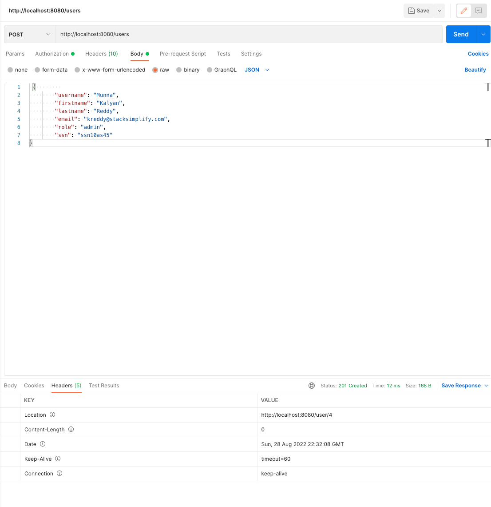

### Step 31. Step-00: Introduction to Exception Handling using ResponseStatusException.md

-   #### Exception Handling and Response Status Codes
-   ResponseStatusException Class
    -   Spring5 introduces the **ResponseStatusException** class which is a fast way for basic error handling in our RESTful API's.
    -   It is an **alternative** to **@ResponseStatus** and is the base class for exceptions used for applying status code to an  **HTTP Response**
    -   We can create an instance of it providing and **HttpStatus** and optionally a **reason** and a **cause**.
    -   It's a **RuntimeException**.
    -   ResponseStatusException constructor arguments
        -   **status** - an HTTP Status set to HTTP response
        -   **reason** - a message explaining the exception set to that particular HTTP response.
        -   **cause** - a Throwable cause of the ResponseStatusException
    -   **Benefits**
        -   We can implement it quite **fast**
        -   There is no specific need for creating **custom exception classess**, unless we have a need becasue we can define HTTP Response Status code and Error message at a time.
        -   As we are creating exceptions programmatically, we will have **more control** over exception handling
    -   **Downside**
        -   **Code Duplication** As we are defining them programmatically, ew find ourselves replicatiing code in multiple controllers.
        -   **Global Exception Handling**: This approach will not look like a global approach like **@ControllerAdvice**. Its difficult to enforce applicaiton-wide conventions.
    -   **Combine Approaches**
        - We can implement **@ControllerAdvice** globally and **ResponseStatueExceptions** locally as anbd when required.
    -   **server.error.include-stacktrace=never** in **application.properties** to disable trace.
    -   **org.springframework.web.util.UriComponentsBuilder**  The main advantages of **UriComponentsBuilder** are the flexibility of using URI template variables, and a possibility of injecting it directly into Spring Controller methods.

#### Creating Steps
-   Step-00: Create git branch - local & remote.md
-   Step 33. Step-01: Implement ResponseStatusException handling for getUserById.md
-   Step 34. Step-02: Implement ResponseStatusException for updateUserById RESTful Service.md
-   Step 35. Step-03: Implement ResponseStatusException for deleteUserById RESTful Service.md
-   Step 36. Step-04: Implement ResponseStatusException for createUser RESTful Service.md
-   Step-05: Implement HTTP Status code & Location Header for createUser Service.md

### Step 32. Step-00: Create git branch - local & remote.md


---------------------------------------------------------------------------------------
Step-00: Create new git branch in local git repo and remote github repo
    - Verify we are in master branch    
        - git status
    - Create new branch
        - git checkout -b 04-ExceptionHandling-ResponseStatusCodes
    - Create new branch in remote github and setup upstream   
        - git push --set-upstream origin 04-ExceptionHandling-ResponseStatusCodes
    - Verify new branch in remote github & IDE GIT Perspective             
        - https://github.com/stacksimplify/springboot-buildingblocks             
        
-   $git status

### Step 33. Step-01: Implement ResponseStatusException handling for getUserById.md

----------------------------------------------------------------------------------------
Step-01: Implement "ResponseStatusException" for getUserById
    - Custom Exceptions Layer: 
        - Create "UserNotFoundException" which extends Exception
    - Service Layer:
        - Update the getUserById method with throws Exception
        - Check for user and if not exists throw exception. 
    - Controller Layer: 
        - Update the getUserById method with try catch block.
        - In catch block, implement "ResponseStatusException".
    - Test using postman. 
        - Method: GET 
        - URI: http://localhost:8080/users/101
    - Remove Trace in Exception.
        - When using DevTools, "server.error.include-stacktrace" will be set to always 
            server.error.include-stacktrace=never
        - change to never or on-trace-param
    - Verify the response again.      
        - Exception Message
        - HTTP Status Code           


### Step 34. Step-02: Implement ResponseStatusException for updateUserById RESTful Service.md  --Ongoing

Step-02: Implement "ResponseStatusException" for updateUserById
    - Service Layer:
        - Update the updateUserById method with throws Exception
        - Check for user and if not exists throw exception. 
    - Controller Layer: 
        - Update the updateUserById method with try catch block.
        - In catch block, implement "ResponseStatusException".
    - Test using postman. 
        - Method: PUT 
        - URI: http://localhost:8080/users/1001
        - Request Body: 
        - Verify the response
            - Exception Message
            - HTTP Status Code   
```
{
    "timestamp": "2022-08-28T22:09:46.522+00:00",
    "status": 404,
    "error": "Not Found",
    "message": "User not found in user Repository",
    "path": "/users/1012"
}
```            
    
### Step 35. Step-03: Implement ResponseStatusException for deleteUserById RESTful Service.md
Step-03: Implement "ResponseStatusException" for deleteUserById at Service Layer only
    - Service Layer:
        - Check for user and if not exists throw ResponseStatusException. 
    - Controller Layer: 
        - No changes
    - Test using postman. 
        - Method: DELETE 
        - URI: http://localhost:8080/users/1001
        - Verify the response
            - Exception Message
            - HTTP Status Code  

```
{
    "timestamp": "2022-08-28T22:17:12.311+00:00",
    "status": 400,
    "error": "Bad Request",
    "message": "User Not found in user Repository , provide the correct usedr id",
    "path": "/users/1001"
}
```

### Step 36. Step-04: Implement ResponseStatusException for createUser RESTful Service.md
Step-04: Implement "ResponseStatusException" for createUser 
- Response Status Exception
    - Exception Layer
        - Create "UserExistsException" class
    - Service Layer
        - Update the createUser method with throws Exception
        - Verify if userexists based on username (Username is unique constraint)
        - If not null, throw exception.
    - Controller Layer
        - Update the createUser method with try catch block
        - In catch block, implement "ResponseStatusException".
    - Test using Postman
        - Method: POST 
        - URI: http://localhost:8080/users
        - choose **Body** option  then choose **raw** paste following code.
        ```json        
             {        
        "username": "kreddy",
        "firstname": "Kalyan",
        "lastname": "Reddy",
        "email": "kreddy@stacksimplify.com",
        "role": "admin",
        "ssn": "ssn101"
            }
        ```
        - Request Body: 
        - Verify the response
            - Exception Message
            - HTTP Status Code   
        - Result   
        
        ```json
            {
        "timestamp": "2022-08-28T22:20:13.012+00:00",
        "status": 400,
        "error": "Bad Request",
        "message": "User already exists in repository",
        "path": "/users"
        }
        ```        

        -   to Save Data
        ```json
         {        
        "username": "Chandra",
        "firstname": "Kalyan",
        "lastname": "Reddy",
        "email": "kreddy@stacksimplify.com",
        "role": "admin",
        "ssn": "ssn1045"
        }
        ```

### Step 37. Step-05: Implement HTTP Status code & Location Header for createUser Service.md
Step-05: For createUser Method, implement  HTTP Status code 201 & Location Header path
- HTTP Status Code 201 & Location Header with User URI path  
    - Controller Layer:
        - Implement Service to return HTTP Status code 201
        - Implement Service to return Location Header as user path 
    - Test using Postman
        - Method: POST 
        - URI: http://localhost:8080/users
        - Request Body: 
        - Verify the response
            - HTTP Status code
            - Location Header in Response Headers

    - choose **Body** option  then choose **raw** paste following code.
        ```json        
              {        
        "username": "Munna",
        "firstname": "Kalyan",
        "lastname": "Reddy",
        "email": "kreddy@stacksimplify.com",
        "role": "admin",
        "ssn": "ssn10as45"
            }
        ```
        - Request Body: 
        - Verify the response
            - Exception Message
            - HTTP Status Code   
        - Result   
        
        ```json
           1
        ```  
        <p align="center">
	        
        </p>
                          

### Step 38. Step-06: GIT Commit, Push, Merge to Master and Push.md
Step-06: GIT Commit, Push, Merge to Master & Push